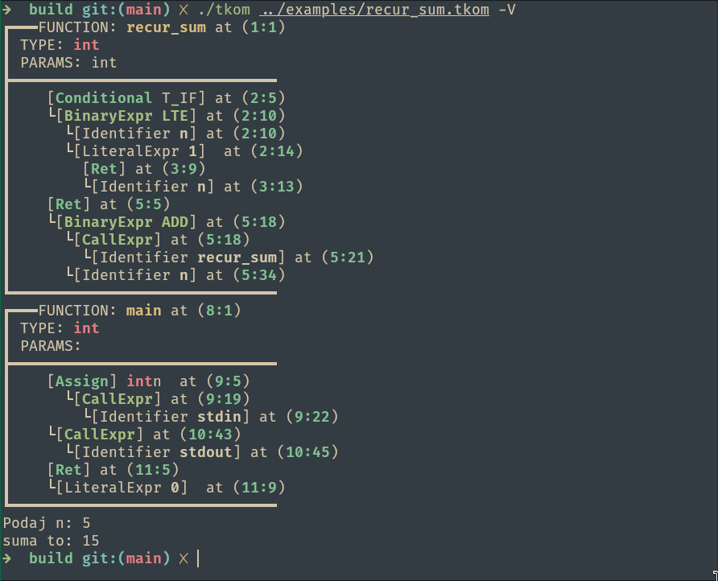

# TKOM Lang


*Bartosz Nowak*

Interpreted Programming Language written in C++ for ZPR and TKOM.

## Getting started

Ensure you have the following installed:
* C++ `Boost` libraries
* `just`
* `cmake`

Then, navigate to the repository's root directory, and run: 

```
just build
```

The build files will be available at `build/`

## Running the project

The compiled binary `./tkom` can be run from the `build/` directory via:

```sh
./tkom [filename] [-V, --verbose]
```

When toggled, the `-V` flag will enable verbose logging, and will print out the parsed syntax tree on the screen:


