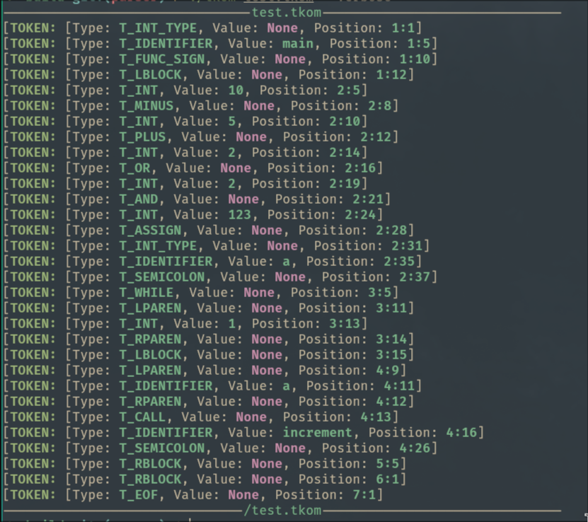

# TKOM/ZPR - Projekt
*Bartosz Nowak, 325201*

## Opis Projektu

Tematem projektu jest implementacja kompilatora własnego języka programowania

## Sposób zbudowania i uruchomienia

Program można zbudować za pomocą skryptu `build.sh`. Wymagane będą:
- narzędzie `CMake`
- biblioteka `Boost`

Zbudowany program możemy uruchomić za pomocą:

```sh
./tkom [filename] [-V]
```
Powyższa wersja programu jest jedynie implementacją leksera. Działa ona poprawnie dla wszystkich plików źródłowych

Gdzie flaga `-V (--verbose)` wypisze na ekran znalezione tokeny.

Dostępna jest również prototypowa wersja programu implementująca szkielet parsera. Może być ona uruchomiona za pomocą:

```sh
./tkom-parser [filename] [-V]
```

Powyższa wersja programu jest **połączeniem** leksera ze szkieletem parsera.

## Zawarta Funkcjonalność

Jak przewidywałem w dokumentacji wstępnej, w ramach szkieletu aplikacji oddaję działający lekser wraz ze szkieletem parsera będącym w stanie bliskim gotowego. (Nie została jeszcze zaimplementowana obsługa funkcji wyższego rzędu - tj. bind front oraz dekoratorów)

Lekser zawiera również obsługę dla błędów leksowania, tj. overflow, unterminated string, invalid identifier itd. Błędy te zwracają informację o napotkanym błędzie oraz pozycję w pliku, w której nastąpiły. Na ten moment błędy kończą działanie programu.

## Testowanie

W katalogu `tests` zawarte są testy jednostkowe dla leksera używające biblioteki Google Test. Testy mogą zostać uruchomione za pomocą polecenia `ctest` w katalogu `build`. Testy jednostkowe zawierają testy dla każdego możliwego typu tokenu oraz niektórych kombinacji

## Zrzuty z działania programu




